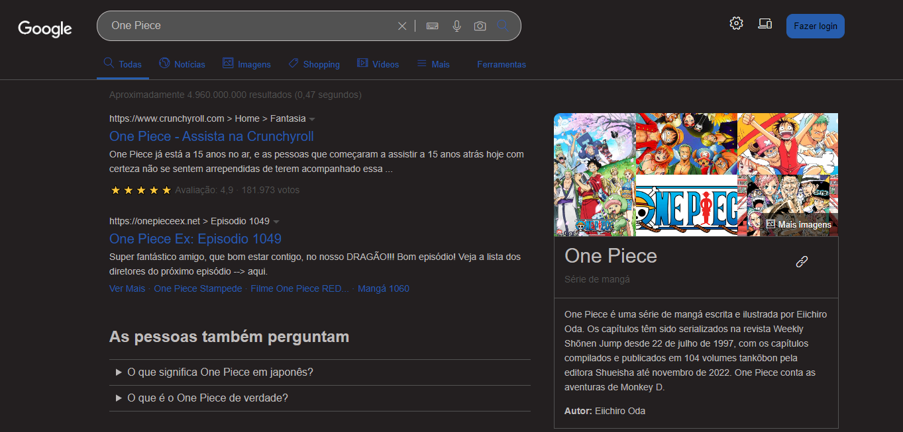

<h1 align="center">< Google Search Clone /></h1>

<p align="center">🖥️ Aplicação clone da Pesquisa Google, com tema escuro. 🖥️ Em construção 🚧</p>

<p align="center">
• <a href="#-sobre-o-projeto">Sobre</a> •
 <a href="#%EF%B8%8F-funcionalidades">Features</a> • 
 <a href="#-demonstra%C3%A7%C3%A3o">Demonstração</a> • 
 <a href="#-como-executar-o-projeto">Como executar</a> • 
 <a href="#-tecnologias">Tecnologias</a> •
 <a href="#%EF%B8%8F-autora">Autora</a> •
</p>

## 💻 Sobre o projeto

Clone do Google Search em tema escuro. Foram utilizadas técnicas HTML5 e CSS3, como pseudoclasses, técnicas de posicionamento e tooltips. A página de pesquisa foi feita com base na pesquisa "One Piece", inicialmente visitada em 25/01/2023.

## ⚙️ Funcionalidades

- [x] O usuário pode encontrar na barra de navegação simulações de:
  - [x] input de pesquisa, com as opções de pesquisar por texto, voz e imagem
  - [x] opção de pesquisa por imagens, notícias, vídeos etc
  - [x] opções de configuração e login

- [x] O usuário pode encontrar na área principal simulações de:
  - [x] os dois primeiros resultados encontrados
  - [x] expansion panels com duas outras sugestões de pesquisa
  
- [x] O usuário pode encontrar na área lateral simulações de:
  - [x] principais imagens trazidas pela pesquisa, junto com o botão de "mais imagens"
  - [x] breve descrição sobre a pesquisa

## 🎨 Demonstração

<p align="center">
  
</p>

## 🚀 Como executar o projeto

Este projeto possui apenas uma parte (Frontend), com as pastas:
1. CSS 
2. Arquivo index.html
3. Images

### Pré-requisitos

É bom ter um editor para trabalhar com o código, como o [VSCode](https://code.visualstudio.com/).

#### 🎲 Rodando a aplicação

``` bash
# Clone o repositório
$ git clone git@github.com:dandara-dias/google-search-clone.git
# Entre na pasta do repositório que você acabou de clonar
$ cd google-search-clone
# Com a extensão Live Server, clique em Go Live
# A aplicação iniciará na porta 5500 - acesse http://localhost:5500 
```
## 🛠 Tecnologias

As seguintes ferramentas foram usadas na construção do projeto:

#### **Website** ([HTML5](https://developer.mozilla.org/en-US/docs/Web/HTML) + [CSS3](https://developer.mozilla.org/pt-BR/docs/Web/CSS))

#### **Utilitários**

-   Editor:  **[Visual Studio Code](https://code.visualstudio.com/)**  → Extensions:  **[Live Server](https://marketplace.visualstudio.com/items?itemName=ritwickdey.LiveServer)**
-   Markdown:  **[Rocketseat](https://blog.rocketseat.com.br/como-fazer-um-bom-readme/)**
-   Ícones:  **[LinearIcons](https://linearicons.com/free)**
-   Paleta de cores: **[Coolors](https://coolors.co/palette/231f20-bebbbb-525252-f5f5f5-275dad)**

## 🦸‍♀️ Autora

 
 <b>Dandara Dias</b> 🎀
 
[](https://www.linkedin.com/in/dandara-dias/) 
<a href = "mailto:dandaradias.contato@gmail.com"></a>
